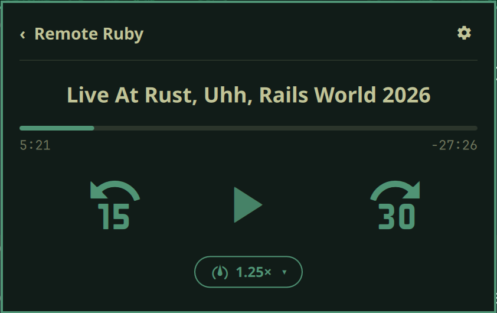
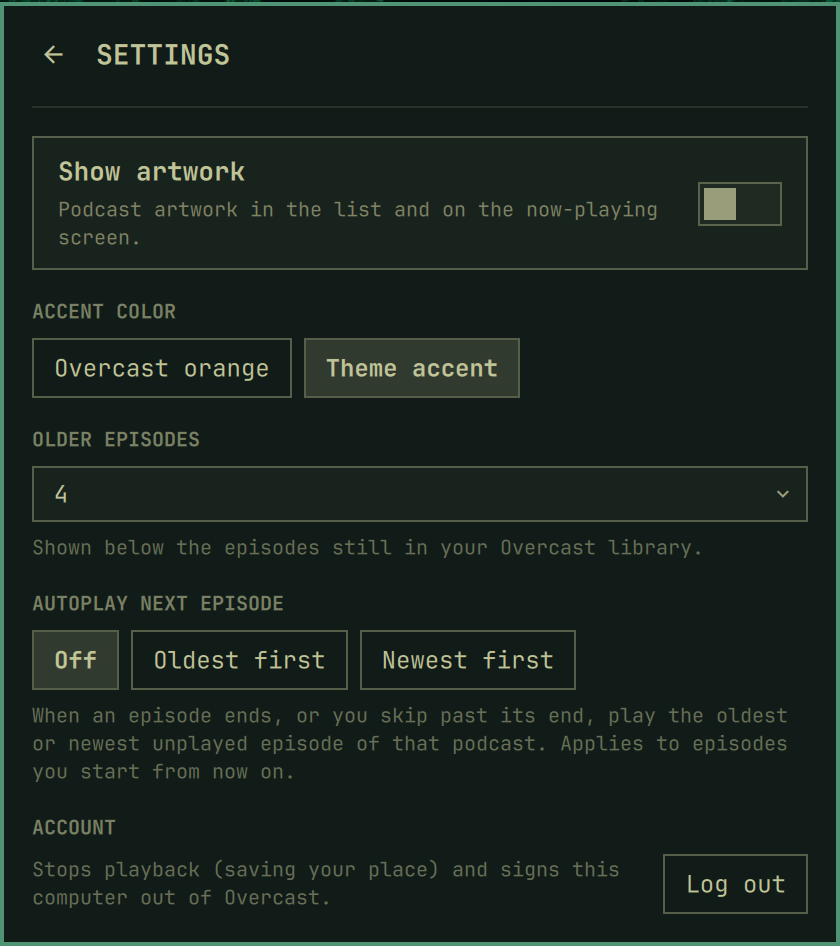

# OmaOvercast

An unofficial [Overcast](https://overcast.fm) podcast player for the Omarchy bar. Browse the podcasts you subscribe to, play episodes with mpv, and keep your place in sync with Overcast on your phone.

<p align="center">
  
  
</p>

> **Unofficial.** OmaOvercast is not made by, affiliated with, or endorsed by Overcast. Overcast has no public API, so the plugin reads the same web pages you see when you log in at overcast.fm. If Overcast changes those pages, the plugin can break until it's updated.

## Features

- **Your subscriptions:** a list of the podcasts you subscribe to. Podcasts with unplayed episodes are marked with a dot.
- **Episodes:** for each podcast, the episodes still in your Overcast library, followed by a few older ones. You choose how many.
- **Playback with mpv:** resumes where you left off, at the speed you set in Overcast.
- **Progress sync:** your position is saved to your Overcast account every 10 seconds of listening and whenever you stop. An episode played to the end is marked finished, just as in the Overcast apps.
- **Now-playing screen:** large 15-second-back, play/pause and 30-second-forward controls, plus a speed menu (0.75× to 2×), the episode date, and an ⓘ button that opens the podcast and episode details Overcast shows (description, notes snippet, website link; artwork follows the setting). Speed changes are saved to Overcast right away.
- **Stays in sync across devices:** when you open the panel, or after your computer wakes from sleep, the player jumps to the position another device saved in Overcast.
- **Autoplay (optional):** when an episode ends, or you skip past its end, the oldest (*Oldest first*) or newest (*Newest first*) unplayed episode of that podcast starts. Order follows Overcast's episode list, so several episodes on one day stay in order.
- **Works with your media keys:** the built-in `omarchy.media` widget and the media keys control playback through mpv's MPRIS support.
- **Sign-in page:** if you're not signed in, or your session expires, the panel shows a sign-in page. It recovers on its own once you've logged in.

## Requirements

- Omarchy with the Quickshell-based shell (plugins and `omarchy plugin` commands).
- An Overcast account. A free account is enough: the overcast.fm web player, which this plugin uses, is available on free accounts.
- Everything else is part of a standard Omarchy install: `mpv`, `mpv-mpris`, `python`, `curl` and `wl-clipboard`.

## Install

```bash
omarchy plugin add https://github.com/RobertStevenson/omaovercast --enable
```

Plugins run unsandboxed inside the Omarchy shell, so read the code before enabling it. If you added it without `--enable`, enable it once you've reviewed it:

```bash
omarchy plugin enable robertstevenson.omaovercast
```

The widget goes in the right section of the bar by default. To move it:

```bash
omarchy bar move robertstevenson.omaovercast --section center
```

## Sign in

Click the podcast icon in the bar, then **Sign in to Overcast…**. A terminal opens and asks for your Overcast email and password.

- Your password goes straight to overcast.fm and is never written to disk.
- Only the session cookie is saved, at `~/.local/state/omaovercast/cookies.txt`, readable only by you.

You can also run the login script yourself:

```bash
~/.config/omarchy/plugins/robertstevenson.omaovercast/bin/overcast-login
```

To sign out, open the settings page (gear icon) and choose **Log out**. This stops playback, saves your place, ends the session on overcast.fm and deletes the cookie.

## Usage

| In the bar | Action |
|---|---|
| Left click | Open or close the panel |
| Middle click | Pause or resume |

| In the panel | Action |
|---|---|
| Click a podcast | Show its episodes |
| Click an episode | Play it and switch to the now-playing screen |
| `‹ Podcast name` | Go back |
| `▶ Now playing` | Return to the now-playing screen |
| Space / Enter (now-playing screen) | Pause or resume |
| Esc | Close the speed menu, go back, or close the panel |
| Overcast logo / title | Open overcast.fm in your browser |

### Rewind and fast-forward keys (optional)

Your keyboard's previous/next (or rewind/fast-forward) keys can jump back 15 seconds and forward 30 seconds in the episode, and still skip tracks in other players. `overcast media-key` seeks when an OmaOvercast episode is playing, or is paused while nothing else is. Otherwise it does Omarchy's usual previous/next track. Add this to `~/.config/hypr/bindings.lua`:

```lua
hl.unbind("XF86AudioPrev")
hl.unbind("XF86AudioNext")
local omaovercast = "~/.config/omarchy/plugins/robertstevenson.omaovercast/bin/overcast media-key "
o.bind("XF86AudioPrev", "Back 15s / previous track", omaovercast .. "back", { locked = true })
o.bind("XF86AudioNext", "Forward 30s / next track", omaovercast .. "forward", { locked = true })
o.bind("XF86AudioRewind", "Back 15s / previous track", omaovercast .. "back", { locked = true })
o.bind("XF86AudioForward", "Forward 30s / next track", omaovercast .. "forward", { locked = true })
```

Remove those lines to go back to Omarchy's default track skipping.

## Settings

Open them with the gear icon in the panel. Changes are saved to the widget's entry in `~/.config/omarchy/shell.json`.

| Setting | Options | Default |
|---|---|---|
| Show artwork | On, Off | Off |
| Accent color | Overcast orange, Theme accent | Overcast orange |
| Older episodes | None, 1–5, All | 4 |
| Autoplay next episode | Off, Oldest first, Newest first | Off |

**Older episodes** is how many episodes to show below the ones still in your Overcast library. **All** shows the newest 30 episodes of the podcast whatever their state, including ones you've already finished.

The same settings can be set from the command line:

```bash
omarchy bar set robertstevenson.omaovercast accentColor Theme
omarchy bar set robertstevenson.omaovercast showArtwork true --json
omarchy bar set robertstevenson.omaovercast olderEpisodes All
```

## How it works

The QML panel calls a small Python backend, `bin/overcast`, that you can also run on its own:

```text
overcast podcasts            JSON list of subscribed podcasts
overcast episodes <path> [n] in-library episodes plus n older (None, 1-5), or All (newest 30)
overcast play <path>         play an episode
overcast status              JSON now-playing state
overcast toggle | stop       pause/resume or stop playback
overcast seek <seconds> [absolute]  relative seek, or to a position
overcast speed <id>          set speed by Overcast id (750, 0=1x, 1250 ... 3000)
overcast media-key back|forward  seek the episode, or previous/next track in other players
overcast logout              stop playback, end the session, delete the cookie
```

When you play an episode, the backend starts a detached session process that runs mpv with a JSON IPC socket. Once a second it reads mpv's position and speed, and it saves your progress to Overcast with the same request the overcast.fm web player uses.

Everything the plugin stores lives in `~/.local/state/omaovercast/`: the session cookie, the mpv socket, and a small file describing the episode that's playing.

## Troubleshooting

- **The panel says "Please sign in" after you've logged in:** your session may have expired. Sign in again.
- **Nothing plays:** check that `mpv` is installed and that the episode plays on overcast.fm. Some publishers' audio servers are occasionally down.
- **The lists come back empty or broken:** Overcast may have changed its pages. Please [open an issue](https://github.com/RobertStevenson/omaovercast/issues).

## Remove

```bash
omarchy plugin remove robertstevenson.omaovercast
rm -rf ~/.local/state/omaovercast
```

Log out from the settings page first if you want the session ended on Overcast's side too.

## License

[MIT](LICENSE). Overcast is a trademark of its owner; this project uses the name only to describe what it works with.
